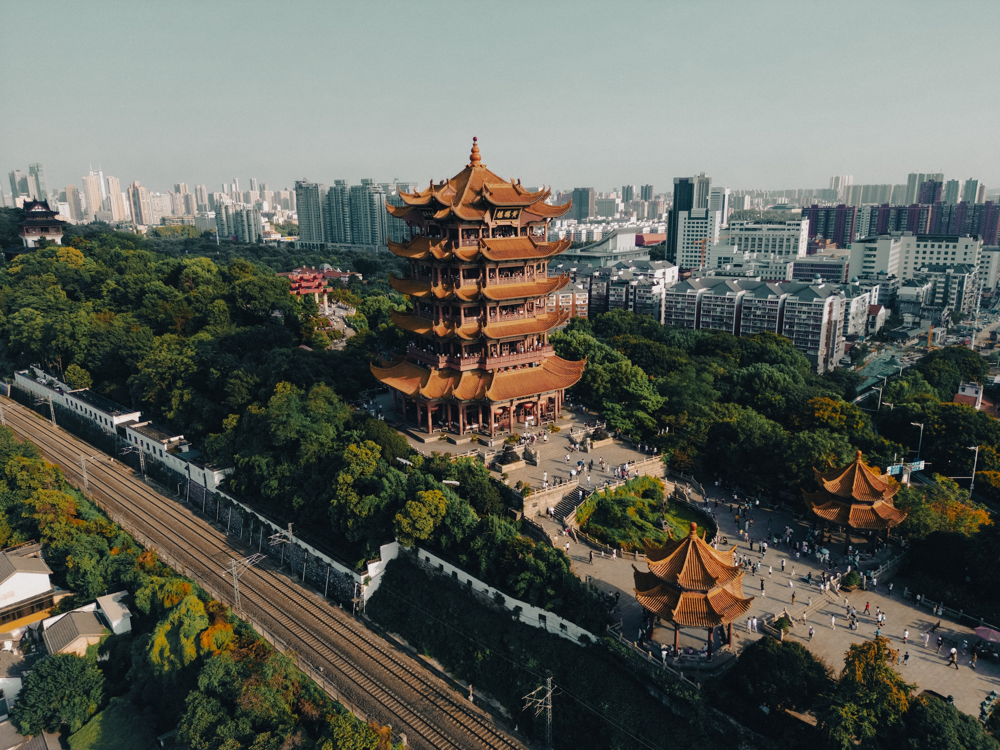

# Anaglyph

This crate produces [anaglyphs](https://en.wikipedia.org/wiki/Anaglyph_3D) from any image decodable with the [image](https://crates.io/crates/image) crate.  
Choose your input image, the output filename, the horizontal/vertical offsets between the two colors, and the two colors.  
The output color couples are the ones listed [here](https://en.wikipedia.org/wiki/Anaglyph_3D#Anaglyphic_color_channels).

License: MIT OR Apache-2.0

## Example usage:
With this (awesome) sample image, by Bao Menglong on Unsplash: 



And this code: 
``` rust
create("bao-menglong-unsplash.jpg", "output_bottomright.png", 100, 20, Coloring::RedCyan);
create("bao-menglong-unsplash.jpg", "output_topright.png", 70, -14, Coloring::RedGreen);
create("bao-menglong-unsplash.jpg", "output_bottomleft.png", -30, 8, Coloring::Anachrome);
create("bao-menglong-unsplash.jpg", "output_topleft.png", -10, -2, Coloring::Trioscopic);
```

## Results (put on your /🟥∧🟦\ glasses): 
#### output_bottomright.png:  

#### output_topright.png:  

#### output_bottomleft.png:  

#### output_topleft.png:  
